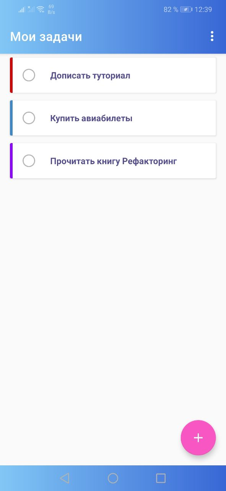
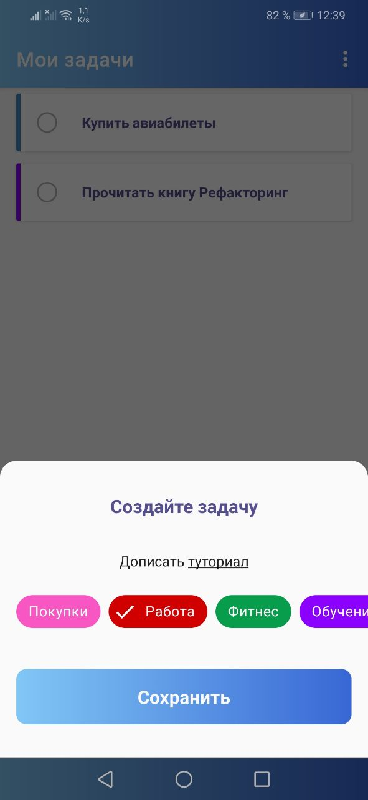

# Демо-приложение для знакомства с Room, Kotlin Flow
Это проект, выполненный для демонстрации работы [Room и Flow](https://androidschool.ru/courses/using-room-and-kotlin-flow-in-todo-app/)

Чтобы быть в курсе новых туториалов и статей подписывайся на telegram-канал [@android_school_ru](https://t.me/android_school_ru)
Пройти туториал можно на сайте [AndroidSchool.ru](https://androidschool.ru/courses/using-room-and-kotlin-flow-in-todo-app/)

## Приложение позволяет:

- Просматривать список задач
- Получить список созданных задач через Kotlin Flow
- Сохраняет новые задачи в Room

## В проекте используются следующие библиотеки и фрэймворки 📚:
- Room для хранения данных. [Подробнее](https://developer.android.com/jetpack/androidx/releases/room)
- Android Navigation для навигации между экранами. [Подробнее](https://developer.android.com/guide/navigation/navigation-getting-started)
- Kotlin Flow и Kotlin Coroutines для асинхронной работы. [Подробнее](https://kotlinlang.org/docs/flow.html)

[Подисывайтесь на telegram](https://t.me/android_school_ru)
[Интенсив для middle-разработчиков](http://intensive.androidschool.ru/?utm_source=github&utm_medium=readme&utm_campaign=room_flow)
